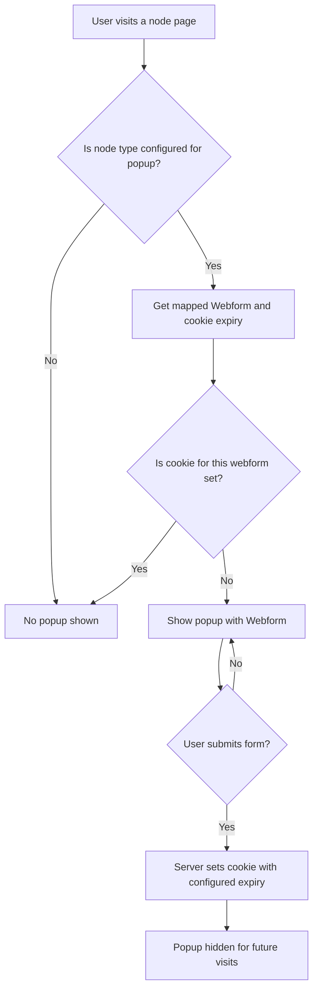

# Webform Popup

A flexible Drupal module that displays a popup with a configurable Webform on selected node types. The popup is hidden after submission using a browser cookie, with cookie expiry configurable per content type.

---

## Features

- Popup appears only on selected content types (node bundles).
- Admin can map each content type to a specific Webform and set cookie expiry (in days).
- Popup is hidden after submission using a browser cookie (per webform).
- All logic is cache-friendly and works with Drupal 10/11.

---

## Configuration Steps

1. **Enable the module** and ensure the [Webform](https://www.drupal.org/project/webform) module is enabled.
2. **Place the "Webform Popup Block"** in a visible region (e.g., Content region) via the Block Layout UI.
3. **Configure the module** at `/admin/config/content/webform-popup`:
    - For each content type, select the Webform to display and set the cookie expiry (in days).
    - Save configuration.
4. **Add the Webform Popup handler** to each Webform you want to use (under Webform > Handlers > Add handler > "Webform Popup: Set Cookie").
5. **Test** by visiting a node of a configured content type. The popup should appear if the cookie is not set, and disappear after submission.

---

## Flow Diagram

---

## Example Configuration Table

| Content Type | Webform  | Cookie Expiry (days) |
|--------------|----------|----------------------|
| Article      | Contact  | 10                   |
| Basic page   | Demo     | 365                  |

---

## Developer Notes

- The module uses a Webform handler to set the cookie server-side for reliability.
- The popup block uses render arrays for proper form rendering and cacheability.
- Cookie expiry is passed to the frontend and respected by both JS and server logic.
- Follows Drupal coding standards and best practices.

---

## Contributing

Contributions and suggestions are welcome! Please open issues or pull requests on the project repository.

---